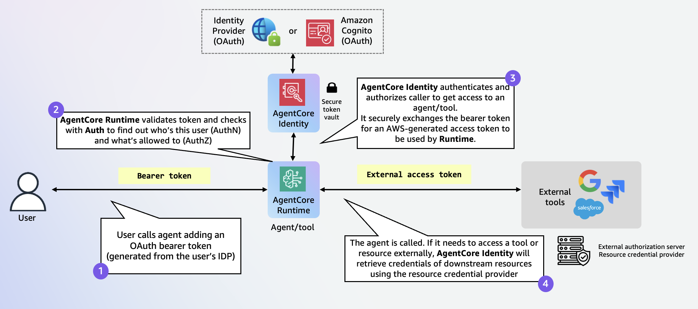
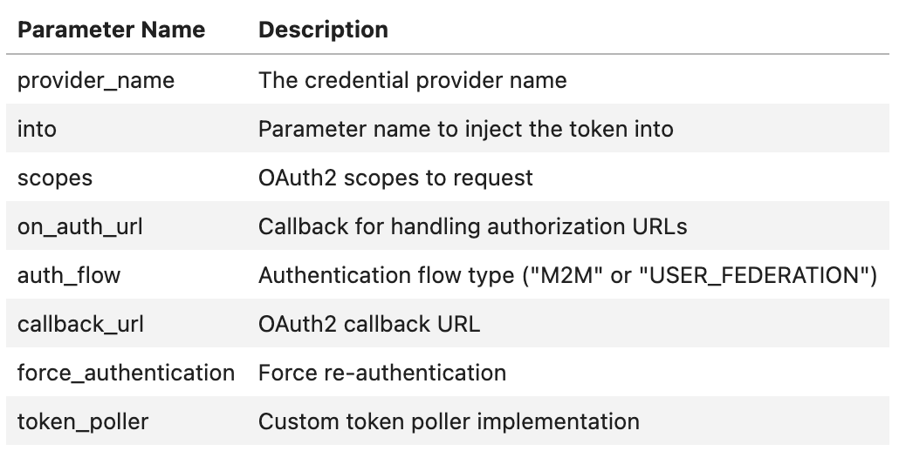
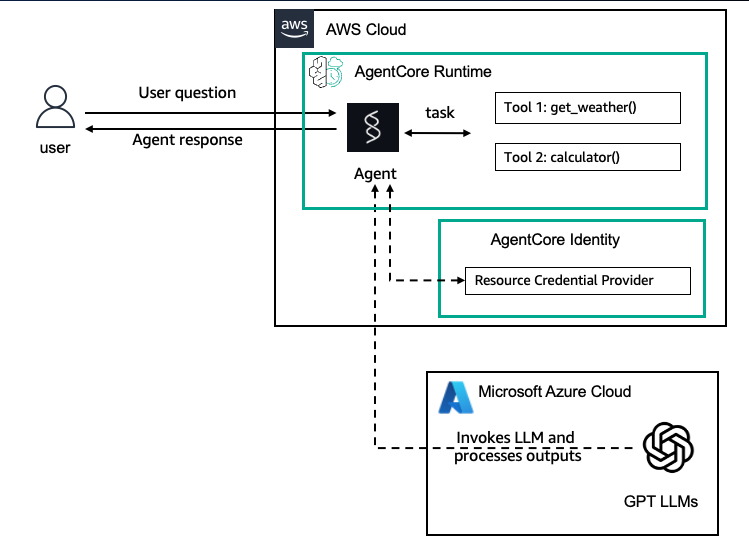
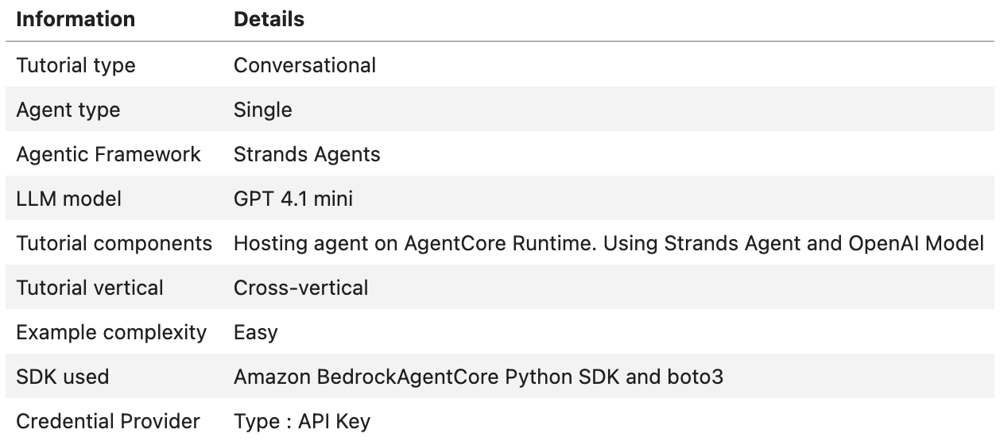

# Outbound Auth

Outbound Auth allows agents and the AgentCore Gateway to securely access AWS resources and third-party services on behalf of users who have been authenticated and authorized during Inbound Auth. To integrate authorization with an AWS resource or third-party service, it's necessary to configure both Inbound Auth and Outbound Auth.

With just-enough access and secure permission delegation supported by AgentCore Identity, agents can seamlessly and securely access AWS resources and third-party tools such as GitHub, Google, Salesforce, and Slack. Agents can perform actions on these services either on behalf of users or independently, provided there is pre-authorized user consent. Additionally, you can reduce consent fatigue using a secure token vault and create streamlined AI agent experiences.


## Outbound Authentication Configuration

First, you register your client application with third-party providers and then create an Outbound Auth. You specify how you want to validate access to the AWS resource or third-party service or AgentCore Gateway targets. You can use OAuth 2LO/3LO or API keys. With OAuth, you can select from providers that AgentCore Identity provides. In which case you enter the configuration details for the providers from AgentCore Identity. Alternatively, you can supply details for a custom provider.

When a user wants access to an AWS resource or third-party service or AgentCore Gateway target, the Outbound Auth confirms that the access tokens provided by Incoming Auth are valid and if so, allows access to the resource.




## Resource credential providers

This is a component that agent code uses to retrieve credentials of downstream resource servers (e.g., Google, GitHub) to access them, e.g., fetch emails from Gmail, add a meeting to Google Calendar. It removes the heavy-lifting of agent developers implementing 2LO and 3LO OAuth2 orchestration flows across end-users, agent code, and external authorization servers. AgentCore provides both a custom OAuth2 credential provider and a list of built-in providers such Google, GitHub, Slack, Salesforce with authorization server endpoint and provider-specific parameters pre-filled.

Bedrock AgentCore Identity provides OAuth2 and API Key Credential Providers for agent developers to authenticate with external resources that support OAuth2 or API key. In the following example, we will walk you through configuring an API Key credential provider. An agent can then use the API Key credential provider to retrieve the API key for any agent operations. Please refer to the documentation for the other credential providers.

### Creating a resource credential provider.

Here is an example of creating a API Key resource credential provider.

```python
from bedrock_agentcore.services.identity import IdentityClient
identity_client = IdentityClient(region="us-west-2")

api_key_provider = identity_client.create_api_key_credential_provider({
    "name": "APIKey-provider-name",
    "apiKey": "<my-api-key>" # Replace it with the API key you obtain from the external application vendor, e.g., OpenAI
})
print(api_key_provider)
```

### Retrieving access tokens or API keys from the Resource credential provider.

Here is an example of retrieving the API key from the API Key credential provider. The agent can use the API key to interact with services like a LLM or other services that use an API key configuration. In order to retrieve credentials like access_token or API key from the credential provider, you can decorate your function as shown below.

```python
import asyncio
from bedrock_agentcore.identity.auth import requires_access_token, requires_api_key

@requires_api_key(
    provider_name="APIKey-provider" # replace with your own credential provider name
)
async def need_api_key(*, api_key: str):
    print(f'received api key for async func: {api_key}')

await need_api_key(api_key="")
```

Here are the various parameters you can use with the @require_access_token decorator.




# Hosting Strands Agents with OpenAI models in Amazon Bedrock AgentCore Runtime

### Overview
In this tutorial we will create a new agent and deploy it on AgentCore-runtime, it uses openai-model and configure it for Outbound Auth using the API Key credential provider. You will set up an API Key credential provider to store the open-ai key and modify the agent code to use this key.

### Tutorial Architecture



### Tutorial Details




### Tutorial Key Features

- Hosting Agents on Amazon Bedrock AgentCore Runtime
- Using OpenAI models
- Using Strands Agents
- Using AgentCore egress Auth with API Key credential provider.


### Prerequisites
To execute this tutorial you will need:

- Python 3.10+
- AWS credentials
- Amazon Bedrock AgentCore SDK
- Strands Agents
- Docker running

Now, open the notebook *runtime_with_strands_and_openai_models.ipynb* to run through an example.