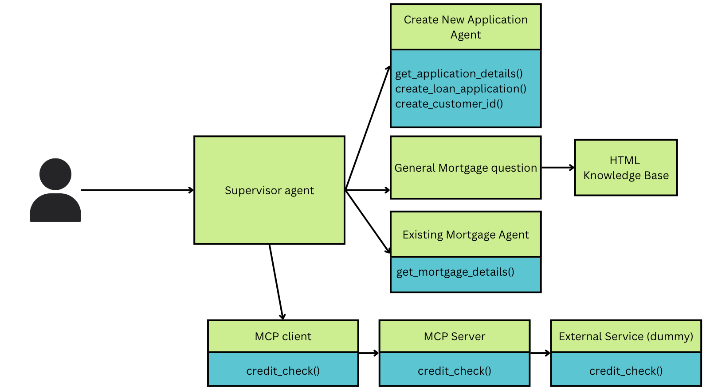
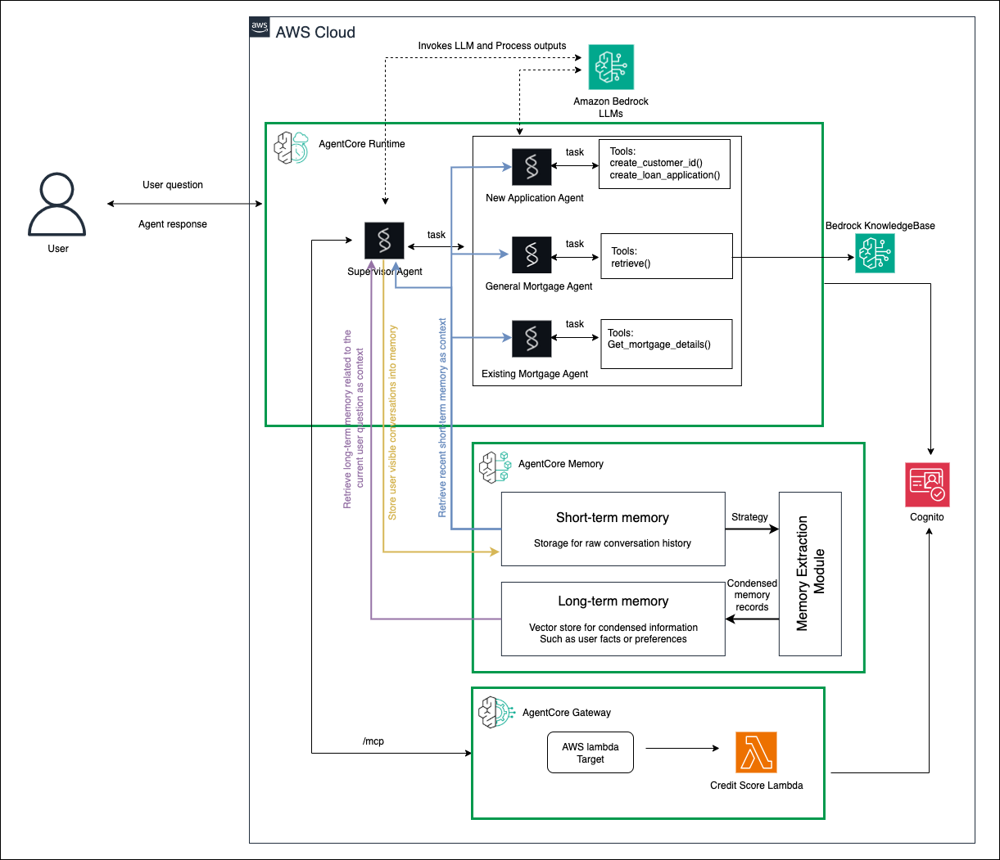

# Amazon Bedrock AgentCore enablement

Welcome to the AgentCore enablement session!

Amazon Bedrock AgentCore provides a complete set of capabilities, that enables organizations to deploy and manage AI agents in production environments. This platform offers developers the flexibility to work with any foundation models, whether hosted on Amazon Bedrock or elsewhere, any agent frameworks, while maintaining enterprise-level security and scalability.

## What you will learn

You will learn about the AgentCore capabilities through a practical implementation of a mortage assistant use case. You will be starting with building a prototype in your local environment and progressively add AgentCore capabilities to take the prototype to production.

## Mortage assistant use case

The mortgage assistant use case is about an AI-powered agent that helps customers with the home loan (mortgage) process from start to finish.

In this scenario, the assistant can:
* Guide a customer through applying for a new mortgage.
* Answer general questions about mortgage products and terms.
* Handle queries about an existing mortgage.
* Perform credit checks and other validations during the application process.
* Route the customer’s request to the right “specialist” (other agents) when needed.

Essentially, it acts like a virtual mortgage advisor, combining multiple AI agents and external checks so the customer gets accurate, personalized, and compliant responses without needing to talk to multiple bank staff.

The agentic architecture for the mortage assistant looks like in the diagram below



## Bedrock AgentCore architecture

You will be going through a series of tutorials in the session to build out the mortage assistant using AgentCore Components as shown below



TODO: Need to include memory and identity components.

## Learning Path

Below is the order in which you will have to run the labs. We will create the prototype of a Mortgage assistant agent using Strands SDK and then progressively integrate with AgentCore components in the below order. Each of the sections are also self contained and you can run it independently (Prequisite section is required to create the Knowledge base).

1. [Prerequisite](./01-Prerequisite/) - This directory contains all the Python files and the notebooks to create the resources used in the subsequent sessions, like creating the knowledge base, etc

    *  [01_create_knowledgebase.ipynb](./01-Prerequisite/01_create_knowledgebase.ipynb) - Run this notebook to create the Bedrock KnowledgeBase which will be used by one of the sub-agents to answer general mortgage questions.

2. [Strands-mortage-assistant](./02-Strands-mortage-assistant/) - You will be creating a multi-agent mortgage assistant using the **Strands Agents SDK**. You will be running the muti-agent application locally.

3. [Runtime](./03-agentcore-runtime/strands-runtime/) - You will be packaging and deploying your agent to the AgentCore Runtime

4. [Gateway](./04-agentcore-gateway/) - You will be implementing the credit check funcitonality as an MCP server exposed through Lambda as the gateway target. You will be extenting the mortgage assistant developed in the previous section to combine the custom tools, Strands native tools and the tools exposed through the AgentCore Gateway.

5. [Identity](./05-agentcore-identity/) - You will learn more on how to add OAuth authentication to access the AgentCore Gateway and Runtime. You will learn more about the inbound and outbound authentication flows.

6. [Memory](./06-agentcore-memory/) - You will be extending the mortgage assistant to be context aware while it is responding the end user queries. You will be lerning how to implement short-term and long-term capabilities.

7. [Observability](./07-agentcore-observability/) - Here we will be showing you how to use AgentCore Observability CloudWatch integration to monitor and debug production agents.

8. [Tools](./08-agentcore-tools/) - You will learn how to setup code intepreter tool, integrate to the existing mortgage agent and test the dynamic code execution feature

## Setup

You will be using your laptop for running the labs. The labs are all tested on Visual Studio Code and is the preferred code editor.

### Prerequisites
- Install [uv](https://docs.astral.sh/uv/getting-started/installation/)
- Install [Visual Studio Code](https://code.visualstudio.com/)
- Configure AWS credentials

### Quick Setup

1. Clone this repository and navigate to the workshop directory
2. Run the setup script:
   ```bash
   ./setup.sh
   ```

### Manual Setup

If you prefer manual setup:

```bash
# Clone the repository
git clone <repository-url>
cd workshop-agentcore

# Install dependencies
uv sync

# Verify AWS configuration
aws sts get-caller-identity
```

### Running Notebooks

After setup, you can run notebooks in two ways:

1. **Using uv directly:**
   ```bash
   uv run jupyter lab
   ```

2. **Activate virtual environment:**
   ```bash
   source .venv/bin/activate
   jupyter lab
   ```

## Start the workshop

Follow the Jupyter notebooks in each lab folders in sequence, where you see detailed instructions to walk you through building the Mortgage Assistant on AgentCore.
